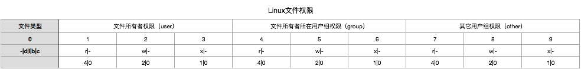
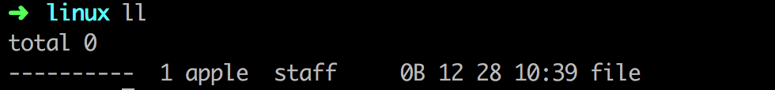

# Linux文件权限
### 权限图

### 权限图详解
权限图分为10个区，共四块，文件类型、文件所有者权限、文件所有者所在用户组权限和其它用户组权限。
- 文件类型
  - ```-```普通文件
  - ```d```文件夹
  - ```l```链接文件
  - ```b```存储设备
  - ```c```一次性读取装置
- 权限
  - ```r```读(4)
  - ```w```写(2)
  - ```x```执行(1)
  - ```-```不具有权限(0)
### 修改权限
通过使用```chmod```命令来修改文件权限，使用改命令的前提是你具有修改该文件的权限，如```root```用户创建的文件普通用户就没有权限进行修改，使用样例。
假设有个普通文件```file```，本身不具有任何权限即```000```。

- 通过字母修改文件权限
```
chmod u+rwx file（文件所有者权限）
chmod g+rwx file（文件所有者所在用户组权限）
chmod o+rwx file（其它用户组权限）
chmod a+rwx file（全部用户权限）
```
- 通过数字修改文件权限
  - 7=4+2+1(读、写、执行)
  - 6=4+2+0(读、写)
  - 4=4+0+0(读)
  - 3=0+2+1(写、执行)
  - 2=0+2+0(写)
  - 1=0+0+1(执行)
  - 0=0+0+0()
```
chmod 777 file(全部用户权限)
```