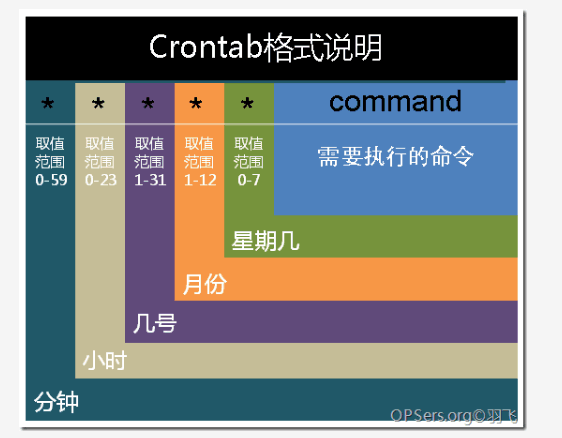

# crontab使用方法
### 简介
crontab命令被用来提交和管理用户的需要周期性执行的任务，与windows下的计划任务类似，格式如下：

### 命令详解
- -e 编辑定时任务
- -l 列出所有定时任务
- -r 删除定时任务
- -u<用户名> 指定设置定时任务的用户名
### 参数详解
- 分 0-59
- 时 0-23
- 日 1-31
- 月 1-12
- 周 0-7
- 执行命令 需要执行的命令
### 特殊字符
- ```*``` 任何取值 
- ```,``` 用来分割多个参数，如```1,2,3```
- ```-``` 用来表示区间，如```1-3```表示```1,2,3```
- ```/``` 每隔，如```0-23/2```表示每隔2小时执行一次
### 实例
- 需要执行的shell脚本(```/home/hello.sh```)
```
#!/bin/sh
echo "Hello Crontab" >> /home/hello.txt
```
- 定时任务(每2分钟执行一次)
```
*/2 * * * * sh /home/hello.sh
```