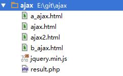
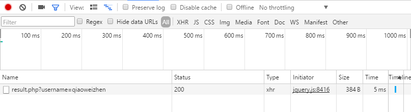
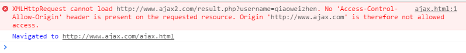
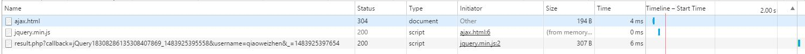
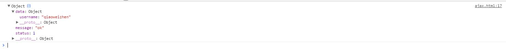
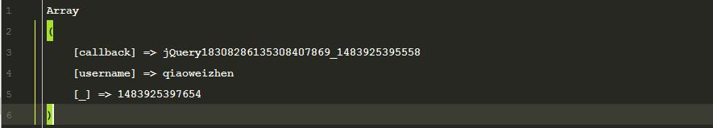
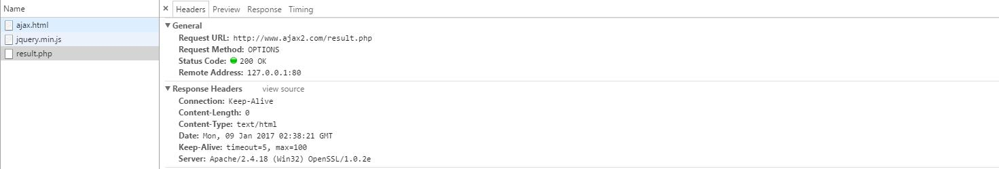
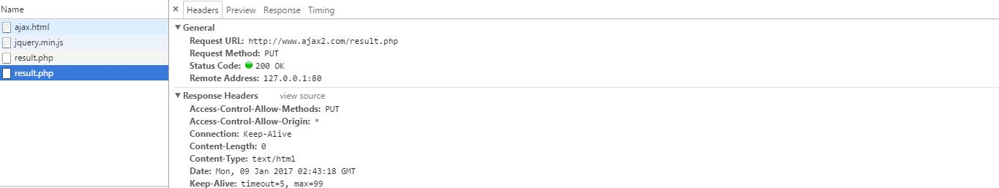

### 跨域请求的产生
跨域请求归根结底是由于浏览器的“同源策略”引起的，同源策略指的是```域名相同```、```协议相同```、```端口相同```，
假设有```http://www.a.com/test.html```，下面的示例
域名不同
```
http://demo.a.com/test1.html
```
协议不同
```
https://www.a.com/test2.html
```
端口号不同
```
http://www.a.com:8090/test3.html
```
### 实验文件列表
先介绍一下文件列表：

- ```a_ajax.html```是在域名```a.ajax.com```下使用
- ```b_ajax.html```是在域名```b.ajax.com```下使用
- ```ajax.html```是在域名```www.ajax.com```下使用
- ```ajax2.html```是在域名```www.ajax2.com```下使用
- ```result.php```是公共使用返回文件
### 跨子域解决方案
如```http://a.ajax.com/a_ajax.html```请求```http://b.ajax.com/result.php```，通过iframe来加载```http://b.ajax.com/b_ajax.html```，同时来提升域的级别，a_ajax.html示例代码：
```
<!DOCTYPE html>
<html lang="en">
<head>
    <meta charset="UTF-8">
    <title>a_ajax</title>
    <script type="text/javascript">
        document.domain = "ajax.com";
    </script>
</head>
<body>
<h1>a.ajax.com</h1>
<iframe src="http://b.ajax.com/b_ajax.html"></iframe>
</body>
</html>
```
b.ajax.html示例代码：
```
<!DOCTYPE html>
<html lang="en">
<head>
    <meta charset="UTF-8">
    <title>b_ajax</title>
    <script src="jquery.min.js"></script>
    <script type="text/javascript">
        document.domain = 'ajax.com';
        function test() {
            $.ajax({
                type: 'GET',
                url: 'http://b.ajax.com/result.php',
                data: {
                    username: 'qiaoweizhen'
                },
                dataType: 'json',
                success: function (response) {
                    console.log(response);
                }
            });
        }
    </script>
</head>
<body>
<h1>b.ajax.com</h1>
<a href="javascript:test();">Submit</a>
</body>
</html>
```
上述例子通过```document.domain = 'ajax.com'```来将```a.ajax.com```和```b.ajax.com```提升到同一个根域```ajax.com```下面来实现跨域。
### jsonp解决方案
如```http://www.ajax.com/ajax.html```请求```http://www.ajax2.com/result.php```，示例代码
ajax.html
```
function test() {
    $.ajax({
        type: 'GET',
        url: 'http://www.ajax2.com/result.php',
        data: {
            username: 'qiaoweizhen'
        },
        dataType: 'json',
        success: function (response) {
            console.log(response);
        }
    });
}
```
result.php文件示例代码：
```
<?php
$fp = fopen('log.txt', 'w+');
fwrite($fp, print_r($_REQUEST, true));
fclose($fp);
```
如果使用上述代码去请求的话，先查看url，只有一个我们自己使用的参数```username```：

然后查看一下报错信息：

然后观察服务器端没有产生任何日志文件，则说明在浏览器端就被禁用掉了。如果将请求改成```jsonp```代码如下：
```
function test() {
    $.ajax({
        type: 'GET',
        url: 'http://www.ajax2.com/result.php',
        data: {
            username: 'qiaoweizhen'
        },
        dataType: 'jsonp',
        success: function (response) {
            console.log(response);
        }
    });
}
```
发起请求的话，就会发现url有所变化，使用jquery会默认增加```callback```和```_```参数：

查看控制台输出：

而查看服务端日志，如下：

说明两者之间的通信是没有问题，就需要将处理的结果返回给客户端，可以修改```result.php```代码，示例如下：
```
<?php
$fp = fopen('log.txt', 'w+');
fwrite($fp, print_r($_REQUEST, true));
fclose($fp);
$callback = $_REQUEST['callback'];
$username = $_REQUEST['username'];
$response = [
    'status'  => 1,
    'message' => 'ok',
    'data'    => [
        'username' => $username
    ]
];
echo $callback . '(' . json_encode($response) . ')';
```
ok，上面的实例就完成了通过jsonp进行跨域请求的操作，有以下几点需要说明：
- ```jsonp```只支持```GET```请求，这是因为jsonp请求，归根结底是通过动态从服务端加载一段JavaScript脚本来在客户端执行，返回实例：```jQuery183014317321930723415_1483925970177({"status":1,"message":"ok","data":{"username":"qiaoweizhen"}})```
- ```jsonp```中的```callback```是可以自定义的，只需要和```dataType```同级别参数```jsonpCallback```，如```jsonpCallback: 'myCallback'```，在定义一个```myCallback```函数就可以了
- 可不可以在```data```中传入```callback```参数，是可以的，但是容易混淆，而且服务端接收参数的时候只能接收到一个```callback```参数，不建议这么做
### CORS(跨域资源共享)解决方案
上面通过```jsonp```来实现了简单的跨域请求，但是会面临以下几个问题：
- 请求来源是否合法
- 请求数据大小有限制，因为是```GET```请求
- ```jsonp```不提供错误处理机制，即动态加载的返回代码是有问题的话，没有相应的处理机制
解决上面最好的方式是通过```CORS```，经常使用服务端两个参数```Access-Control-Allow-Origin(配置域名)```，```Access-Control-Request-Method(配置方法)```。如```http://www.ajax.com/ajax.html```请求```http://www.ajax2.com/result.php```，ajax.html示例代码如下：
```
function test() {
	$.ajax({
		type: 'GET',
		url: 'http://www.ajax2.com/result.php',
		data: {
			username: 'qiaoweizhen'
		},
		dataType: 'json',
		success: function (response) {
			console.log(response);
		}
	});
}
```
服务端通过设置返回头信息，来进行一定的限制，服务端result.php示例代码如下：
```
<?php
header('Access-Control-Allow-Origin:*');
```
这样子就允许所有域名进行ajax跨域请求，如果需要限制，示例代码如下：
```
<?php
$allowOrigins = [
    'http://www.ajax.com',
    'http://a.ajax.com'
];
if (in_array($_SERVER['HTTP_ORIGIN'], $allowOrigins)) {
    header('Access-Control-Allow-Origin:' . $_SERVER['HTTP_ORIGIN']);
    echo json_encode([
        'status'  => 1,
        'message' => 'ok'
    ]);
}
```
上面的是通过简单请求，如果非简单请求，服务器会先通过预检机制来进行限制，ajax.html示例代码：
```
function test() {
	$.ajax({
		type: 'PUT',
		url: 'http://www.ajax2.com/result.php',
		data: {
			username: 'qiaoweizhen'
		},
		dataType: 'json',
		success: function (response) {
			console.log(response);
		}
	});
}
```
如果发送了一个```PUT```请求，查看请求url，发现是```Request Method:OPTIONS```而不是```Request Method:PUT```，这是因为浏览器和服务器之间进行了一次预检通信机制：

如果服务端设置了，可以使用```PUT```请求，服务端```result.php```代码如下：
```
$allowOrigins = [
    'http://www.ajax.com',
    'http://a.ajax.com'
];
header('Access-Control-Allow-Origin:*');
header('Access-Control-Allow-Methods:PUT');
```
那么就会发生两次请求，一次是预检机制的```OPTIONS```请求，一次是真正的```PUT```请求

