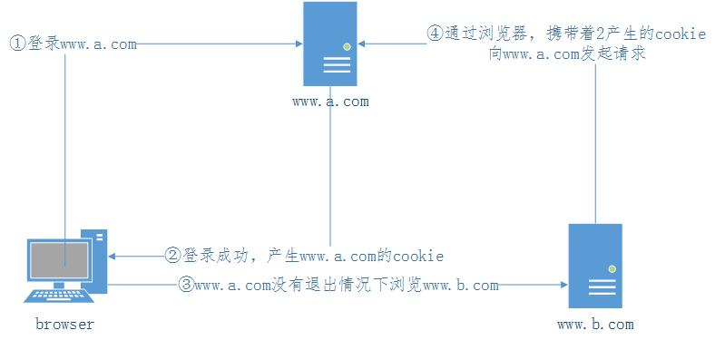

# CSRF原理及防御方法
### 原理
```csrf(Cross-site request forgery)```跨站请求伪造



- 登录```www.a.com```
- 登录成功，产生```www.a.com```下的cookie
- 在未退出```www.a.com```的情况下浏览```www.b.com```
- ```www.b.com```通过浏览器向```www.a.com```发送恶意请求

总结：归根结底是```www.a.com```对请求来源校验有问题

### 防御方法
- 图片验证码
- 检测```HTTP```头信息中的```Referer```
- 自定义```token```
- 自定义请求头