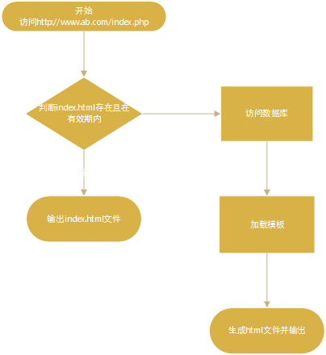

# PHP页面静态化原理
### 原理解析
页面静态化，顾名思义是将动态的```PHP```转化为静态的```Html```，流程如下图



用户访问```index.php```，如果存在```index.html```且在有效期内，则直接输出```index.html```，否则去生成```index.html```

- ```file_put_contents()```输出静态文件
- ```ob_start()```开启```PHP```缓冲区
- ```ob_get_contents()```获取缓冲区内容
- ```ob_clean()```清空缓冲区
- ```ob_get_clean()```相当于```ob_get_contents()```+```ob_clean()```

### 代码示例
```
<?php

if (file_exists('./html/index.html') && time() - filectime('./html/index.html') < 30) {
    require_once './html/index.html';
} else {
    // 引入数据库配置
    require_once "./config/database.php";
    // 引入Medoo类库
    require_once "./libs/medoo.php";
    // 实例化db对象
    $db = new medoo($config);
    // 获取数据
    $users = $db->select('user', ['uid', 'username', 'email']);
    // 引入模板
    require_once "./templates/index.php";
    // 写入html
    file_put_contents('./html/index.html', ob_get_contents());
}
```