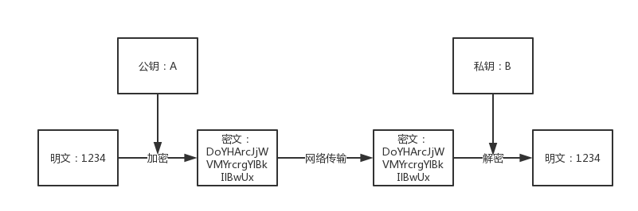
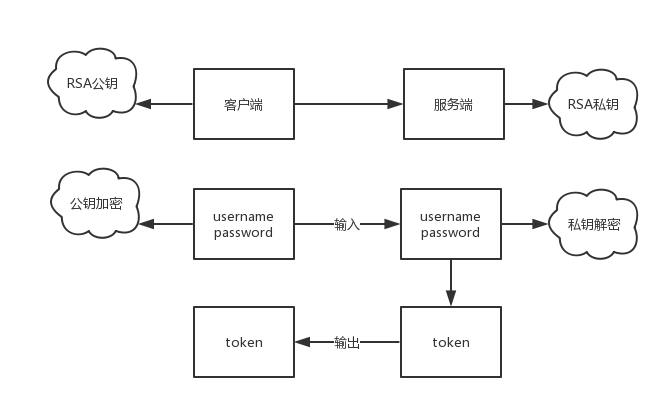
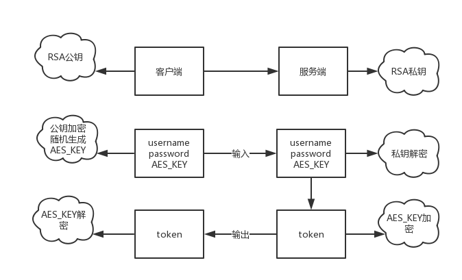

### 关于数据传输安全
> 最近在工作中遇到数据传输安全的问题，具体场景是由手机App请求接口如何保证其安全性
### 不可逆加密算法
```
加密过程中不需要使用密钥，输入明文后由系统直接经过加密算法处理成密文，加密后的数据是无法被解密，只有重新输入明文，并再次经过同样不可逆的加密算法处理，得到相同的加密密文并被系统重新识别后，才能真正解密。
常见的加密算法：MD5、SHA256、SHA512等。
```
### 可逆加密算法
对称加密
```
加密和解密用到的密钥是相同的，这种加密方式加密速度非常快，适合经常发送数据的场合。缺点是密钥的传输比较麻烦。
常见对称加密算法：DES、3DES、AES等
```
流程图如下

非对称加密
```
加密和解密用的密钥是不同的，这种加密方式是用数学上的难解问题构造的，通常加密解密的速度比较慢，适合偶尔发送数据的场合。优点是密钥传输方便。
常见的非对称加密算法为RSA等
```
流程图如下

### 项目中数据传输安全
#### 请求数据加密，响应数据不加密
- 客户端通过```公钥```对需要传输的数据进行加密：```username,password```，生成密文
- 服务端收到密文，通过```私钥```对密文进行解密，生成明文
- 服务端逻辑操作，返回明文```token```
整体流程如下图

#### 请求数据加密，响应数据加密
- 客户端随机生成```AES```加密密钥```AES_KEY```
- 客户端通过```公钥```对需要传输的数据进行加密：```username,password,AES_KEY```，生成密文
- 服务端收到密文，通过```私钥```对密文进行解密，生成明文
- 服务端逻辑操作，返回通过使用```AES```加密算法使用```AES_KEY```作为秘钥加密的```token```，生成密文
- 客户端通过第一步生成的```AES_KEY```解密服务端响应的密文，生成明文
